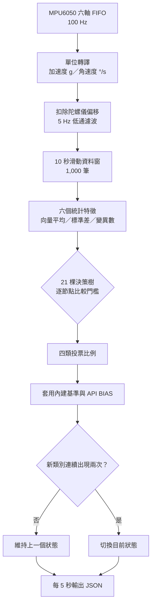
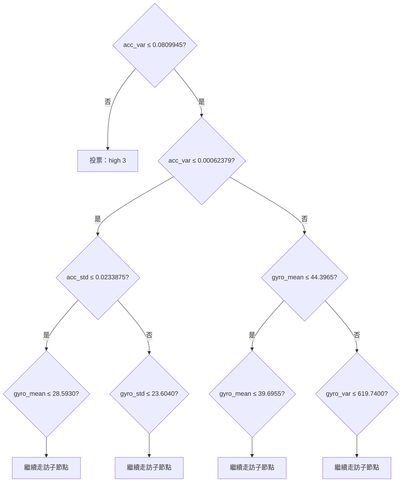

# 決策樹與執行邏輯

## 整體資料流



重點是「5 秒輸出一次」不等於「5 秒才讀一次」。ESP32 持續以 100 Hz 取樣，每累積 100 筆重跑一次森林；序列埠只傳最後狀態。

## 單棵樹怎麼跑

每個分枝節點都包含：`feature`、`threshold`、`left`、`right`。特徵小於或等於門檻就走左邊，否則走右邊，直到 `feature = -1` 的葉節點。葉節點的 `classId` 就是這棵樹的一票。

以下是第 1 棵樹的真實根節點與前幾層；數字直接來自 `auritus_activity_forest.h`：



完整森林有 21 棵樹、2,157 個節點，全部保存在 `src/auritus_activity_forest.h`；上圖只展開一棵樹的前幾層，避免圖面大到無法閱讀。

## 21 棵樹的第一個分枝

| 樹 | 根節點 | 第一個比較 |
|---:|---:|---|
| 1 | 0 | `acc_var ≤ 0.0809945` |
| 2 | 81 | `acc_var ≤ 0.0826870` |
| 3 | 176 | `acc_var ≤ 0.0832970` |
| 4 | 277 | `gyro_var ≤ 119.9350` |
| 5 | 394 | `acc_std ≤ 0.2852200` |
| 6 | 503 | `acc_std ≤ 0.2882900` |
| 7 | 620 | `acc_std ≤ 0.2856650` |
| 8 | 749 | `gyro_var ≤ 118.9350` |
| 9 | 844 | `acc_std ≤ 0.2856650` |
| 10 | 965 | `acc_var ≤ 0.0835360` |
| 11 | 1072 | `acc_std ≤ 0.2852200` |
| 12 | 1201 | `acc_std ≤ 0.2909850` |
| 13 | 1292 | `acc_std ≤ 0.2852200` |
| 14 | 1381 | `acc_var ≤ 0.0816585` |
| 15 | 1458 | `acc_std ≤ 0.2852350` |
| 16 | 1557 | `acc_var ≤ 0.0826870` |
| 17 | 1650 | `gyro_var ≤ 119.9350` |
| 18 | 1753 | `gyro_mean ≤ 16.6660` |
| 19 | 1838 | `gyro_std ≤ 10.8755` |
| 20 | 1925 | `acc_var ≤ 0.0816585` |
| 21 | 2038 | `acc_std ≤ 0.2869100` |

## 最終投票

```text
每棵樹走到葉節點 → 得到 classId 0..3
四類各自計票       → votes[classId] += 1
原始比例           → votes[classId] / 21
調整分數           → 原始比例 + (基準偏移 + API BIAS) × 0.045
最高調整分數       → 候選狀態
連續兩次候選相同   → 正式更新目前狀態
```

`API MODEL` 可即時讀回六個實際特徵與四類原始投票比例，用來確認 ESP32 正在走訪資料庫，而不是用固定假資料。

